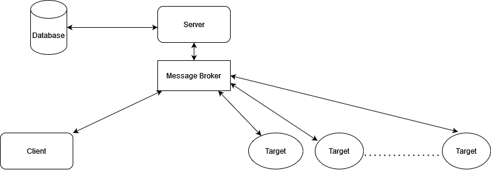

# Ch0nkyBear

## Architecture  

** C2 Server - Python Flask**
-   Handle connections from multiple operators and implants
-   Using Flask as primary listener with Gunicorn as the WSGI
-   Using flask-SqlAlchemy to facilitate CRUD operations on agents and operators

**C2 Client - Python**

**Client UI - Python prompt toolkit**

**Message Broker - RabbitMQ - Pub/Sub**
-   To broker messages between implant and C2, and between client and C2

**Implant - C++** - target should have ch0nky.txt on file
-  Cryptography: Secure
	-   AES-GCM recommended
	-   Tailor payload to a device that has c0nky.txt file path using a secure hash function.
-   Situational awareness: target system data. If system has already been infected.
-   Modify config
	-   remotely update implant configs such as C2 IP/domain
	-   sleep time
	-   Randomness
	-   kill date of implant
	-   server's public key
-   Execution
	-   CreateProcess and redirect output to pipe (shell commands)
	-   Shellcode exec (powershell.exe /c)
	-   Reflective DLL injection/ PE injection/ COFF injection/ Dark LoadLibrary based injection
	-   Bonus: Integrate framework such as Donut
-   Loot: chromium stealer - passwords, cookies, autofill, web history from all user profiles
-   Persistence - RUN registry key
-   File I/O:
	-   read files from victim and send to C2.
	-   Download files from C2 and write to disk.
-   Defense Evasion - Packer to obfuscate payload/RPC to mimic legitimate service.
-   RPC and C2 channel: RPC over HTTPs. Implant must be proxy aware. Should not crash if internet cuts out.
-   Special Feature??

**Database - Postgres/MySQL **-Several tables to correspond to different object models
-   Clients: operators connected to the C2
	Operator should be notified when:
	-   A new implant connects to the C2 server for the first time
	-   A client connects to the C2??
	-   An operator issues a command to an agent (current operator only)
	-   An agent responds to a job that was issued by an operator
-   Commands: Track of which operator issued what command
-   Jobs: Jobs sent to implants along with status of the job
-   Implants:
	-   Implant ID: unique ID for each ID - can generate or target UID data
	-   Computer Name
	-   Username
	-   Machine GUID
	-   Integrity - privileges gained on target
	-   IP address
	-   Session Key
	-   Sleep: How often does the agent check in
	-   Jitter: How random is the check in
	-   First Seen: First check in/ register time
	-   Laster Seen: Last comm with agent
	-   Expected Check in: Next expected comm with agent